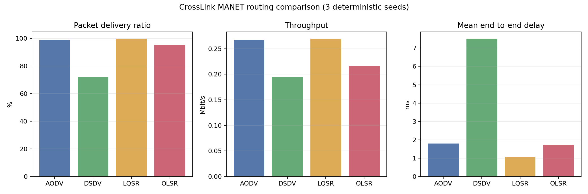
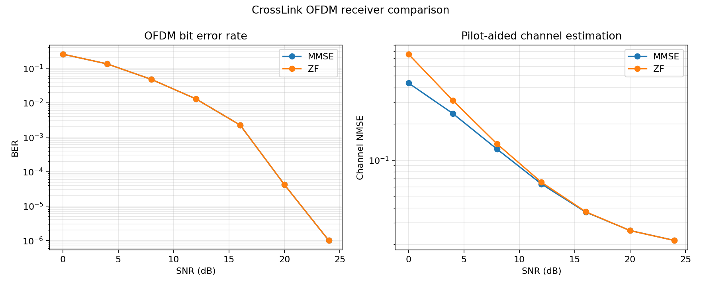

# CrossLink

基于 ns-3 的无线自组网跨层通信仿真与智能路由优化平台。项目把物理层链路、OFDM 接收机、自适应调制编码与 MANET 网络层路由放进同一套可复现实验流程，用于分析信道质量、移动性与路由性能之间的关联。

## 已实现功能

- 物理层链路：BPSK、QPSK、16QAM，AWGN/平坦瑞利衰落，卷积码（约束长度 3、生成多项式 7/5）与硬判决 Viterbi 译码。
- OFDM：64 点 FFT、52 个有效子载波、4 个导频、循环前缀、三径信道、导频辅助信道估计、ZF/MMSE 均衡。
- 链路自适应：以目标 BER 为约束，在 5 档 MCS 中选择最高频谱效率方案。
- MANET 仿真：ns-3.47、802.11g Ad Hoc、Random Waypoint、FlowMonitor；支持 AODV、OLSR、DSDV 与自研 LQSR。
- LQSR 智能路由：融合估算 SNR、误包率、ETX、节点分离速度与通信距离，以 Dijkstra 计算低代价路径并周期性更新路由。
- 实验工程化：Docker 一键构建、固定随机种子、自动参数扫描、结果完整性校验、CSV 轨迹、性能图表、静态实验报告和单元测试。

## 一键运行

只需要 Docker Desktop，无需真实无线硬件，也无需在宿主机安装 ns-3：

```bash
git clone https://github.com/Asmx12345678/CrossLink.git
cd CrossLink
make demo
```

首次构建会下载并编译 ns-3.47，后续使用镜像缓存。实验结果生成在 `results/`：

- `report.html`：汇总报告，可直接用浏览器打开；
- `manet-sweep.csv`：四种路由协议的多随机种子数据；
- `link-sweep.csv`、`ofdm-sweep.csv`、`adaptive-mcs.csv`：链路、OFDM 和 AMC 数据；
- `*.png`：BER、OFDM、AMC 与路由协议对比图；
- `mobility-*.csv`、`routes-*.csv`：节点移动与 LQSR 路由决策轨迹（默认不纳入 Git）。

常用命令：

```bash
make test          # C++ 单元/回归测试
make link-sweep    # 调制编码 BER 扫描
make ofdm-sweep    # OFDM 均衡与 AMC 扫描
make manet-sweep   # ns-3 路由协议对比
```

## 基准结果

默认场景为 30 个节点、700 m × 700 m、最高移动速度 12 m/s、45 s 仿真，以下是 3 个固定随机种子的均值：

| 协议 | PDR | 吞吐量 (Mbit/s) | 平均端到端时延 (ms) |
|---|---:|---:|---:|
| AODV | 98.64% | 0.266 | 1.792 |
| OLSR | 95.37% | 0.216 | 1.734 |
| DSDV | 72.34% | 0.195 | 7.512 |
| LQSR | **99.89%** | **0.270** | **1.043** |

在这组参数下，LQSR 相比 AODV 的 PDR 提高约 1.24 个百分点，平均时延降低约 41.8%。这些数值是特定仿真场景的结果，不应外推为所有网络条件下的普遍结论。





## 系统结构

```text
业务流 / 移动模型
        │
        ▼
┌──────────────────────┐
│ ns-3 802.11g MANET   │── FlowMonitor ──► PDR / 吞吐量 / 时延
│ AODV OLSR DSDV LQSR  │
└──────────┬───────────┘
           │ SNR、ETX、相对运动
           ▼
┌──────────────────────┐
│ LQSR 跨层路由控制器   │── 路径代价 ──► 周期路由更新
└──────────────────────┘

┌──────────────────────┐
│ C++ 物理链路/OFDM     │── BER / EVM / PAPR / NMSE
│ 调制、编码、信道、均衡 │── 目标 BER ──► 自适应 MCS
└──────────────────────┘
```

更详细的设计和算法说明见 [docs/architecture.md](docs/architecture.md) 与 [docs/algorithms.md](docs/algorithms.md)。

## 无真实硬件如何验证

本项目采用软件仿真验证，真实网卡或射频前端不是必要条件。物理层使用确定性随机源构造噪声和衰落；网络层由 ns-3 离散事件仿真器模拟节点、无线信道、移动性和数据流。固定种子使结果可以复现，多种子扫描用于减少单次随机轨迹造成的偏差。

这属于通信算法和网络仿真项目，不应表述成“完成真实硬件外场测试”。如后续有 SDR 或嵌入式设备，可增加 UDP/串口适配器和硬件在环测试，而不需要推翻现有核心算法。

## 目录

```text
apps/       链路、OFDM、AMC 命令行程序
include/    公共 C++ 接口
src/        物理层与 OFDM 实现
ns3/        MANET 与 LQSR 仿真场景
tests/      单元和回归测试
scripts/    参数扫描、绘图与报告生成
docs/       架构与算法文档
results/    可复现实验输出
```

## 技术栈

C++17、CMake、ns-3.47、802.11g、FlowMonitor、Docker Compose、Python/Matplotlib。

## 许可

MIT License。ns-3 自身遵循其上游许可，本仓库的 Docker 构建流程只在构建时下载指定版本。
