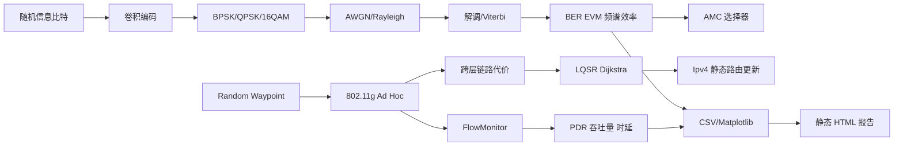

# 架构设计

CrossLink 分为物理链路实验、OFDM/AMC 实验、MANET 网络实验和结果流水线四层，各层通过明确的指标而不是共享仿真内部状态耦合，便于独立测试。

## 数据流

## 可复现性

- Dockerfile 固定 ns-3 版本，隔离宿主机编译器与依赖差异。
- 参数扫描使用固定随机种子；MANET 对比使用相同的三个种子。
- 仿真结果采用机器可读 CSV，图表由脚本生成，不手工修改。
- 核心链路库由 CTest 验证无噪声回环、编解码回环、BER 趋势和 OFDM 基本性质。

## LQSR 与 ns-3 的边界

LQSR 控制器读取 ns-3 节点的位置与速度，结合配置的发射功率和传播模型估计链路质量，建立加权图并计算路径。它通过 IPv4 静态主机路由下发计算结果；802.11 MAC、传播损耗、移动性、应用流量和性能统计仍由 ns-3 负责。

这种分层使 LQSR 的决策可以记录、解释和回放，同时保持与 AODV、OLSR、DSDV 相同的无线场景和流量基线。
